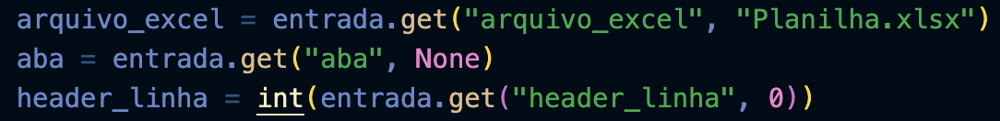
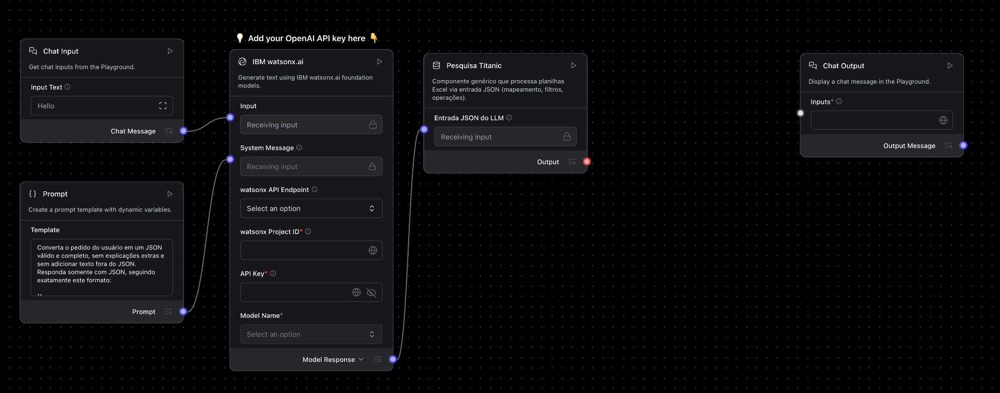
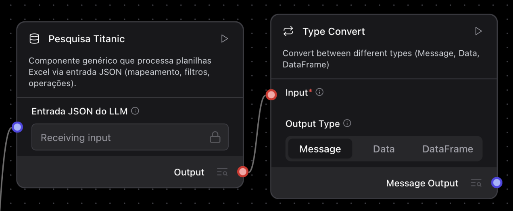
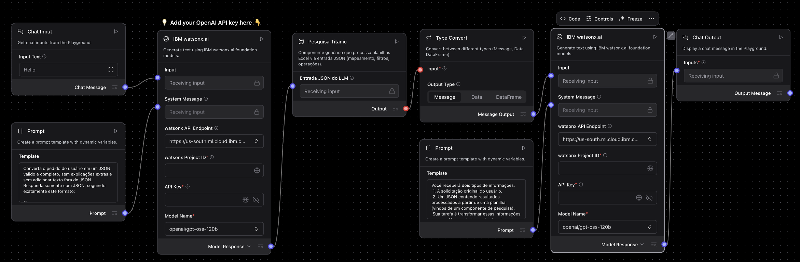
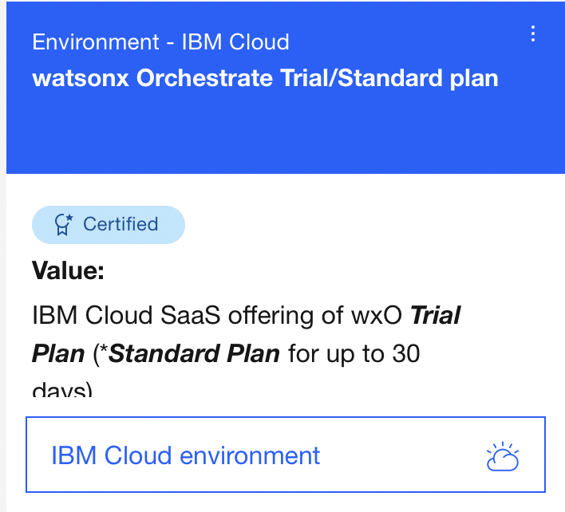
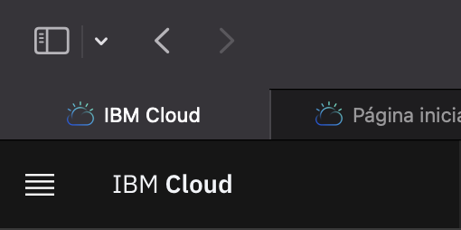
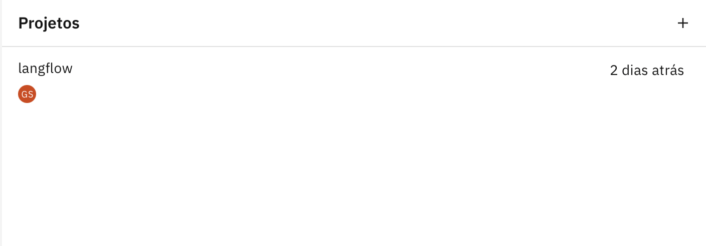
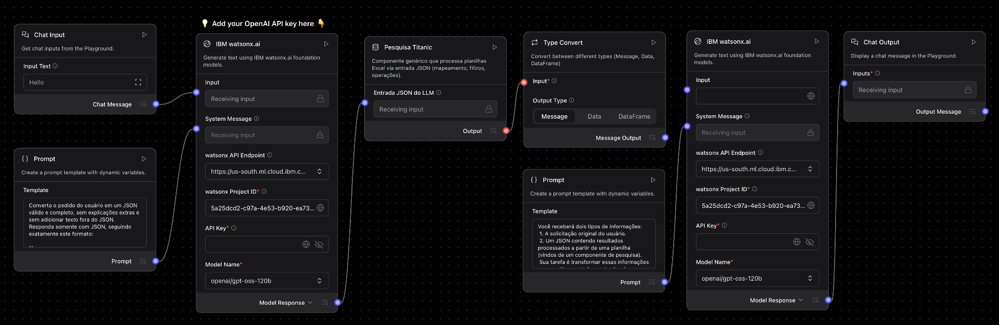
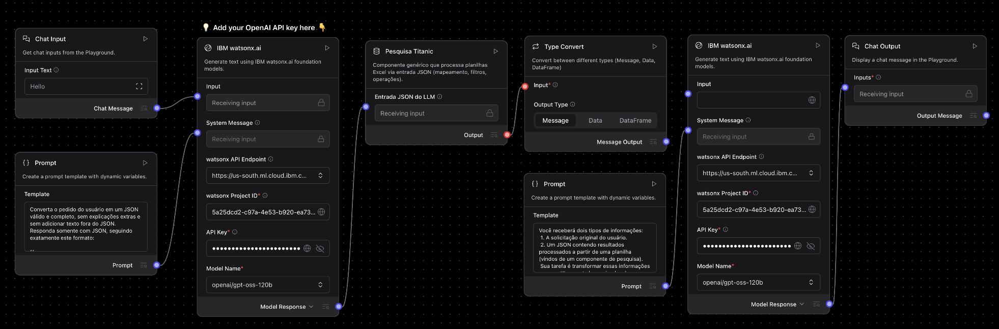

# Tutorial: Como Rodar a Ferramenta de Pesquisa no Langflow

Este tutorial explica o **passo a passo** de como rodar o **fluxo** dentro do **Langflow**, desde a configuração inicial até a execução completa.  
O objetivo é auxiliar usuários a entenderem como importar, configurar e executar o fluxo de maneira correta.

---

## 1. Baixando o Langflow
Antes de começar, é necessário ter o **Langflow** instalado no seu computador. O aplicativo deve ser instalado pelo site do Langflow.
> Site: https://www.langflow.org

## 2. Abrindo um fluxo do tipo Basic Prompting

Com o Langflow aberto:
Clique em **“New Flow”** no canto superior direito.
Na janela de modelos, selecione o template chamado “Basic Prompting”.

  

## 3. Substituindo a LLM pelo modelo IBM Watson AI
O fluxo **“Basic Prompting”** vem com uma caixinha de modelo de linguagem padrão.
Antes de rodar o fluxo, vamos substituí-la pelo componente da IBM watsonx.ai.
- Clique sobre a caixa da LLM existente no fluxo e clique em **delete**
- No painel lateral esquerdo, vá até a aba Components.
- No campo de busca, digite “IBM”.
- Arraste o componente chamado **IBM watsonx.ai** para dentro do fluxo. É a segunda caixinha da lista

  

Conecte-o novamente à caixa de entrada (Input) e à caixa de prompt da LLM, da mesma forma que estava o modelo anterior.
Para conectar os componentesn é necessário ligar uma bolinha na outra.
> Iremos configurar esse componente mais para frente.

## 4. Definindo a descrição para a LLM
Depois de conectar o componente IBM watsonx.ai, é hora de configurar a descrição (prompt) que orienta o comportamento do modelo.
Essa descrição define como a LLM deve interpretar o pedido do usuário e gerar a saída no formato JSON correto.
- Clique no componente do watsonx.ai.  
- Clique na caixinha abaixo de templete para editar o prompt e apague o texto existente.
- Coloque TODAS as instruções que a LLM deva seguir para conseguir criar as entradas corretas de acordo com as perguntas.
> Dica: Coloque exemplos de inputs e suas respectivas entradas para facilitar o trabalho da LLM.
- Clique no arquivo abaixo e veja um exemplo de descrição:

👉🏼 [Clique aqui para visualizar o arquivo `prompt_llm.txt`](codigo/LLM4.txt)

## 5. Adicionando um componente customizado ao fluxo
Agora, vamos inserir um componente customizado no fluxo.
Esse componente contém um código personalizado que você pode importar ou colar diretamente dentro do Langflow.
- Na aba de componentes, clique em **"New Custom Component"**
- Clique sobre ela e clique em "<> code" para abrir o editor de código.

  

- Copie o conteúdo do arquivo abaixo, cole dentro do editor, faça as adaptações necessárias e clique em salvar.

👉🏼 [Clique aqui para baixar o arquivo `custom_component.py`](codigo/langflow.py)

> **É necessário apagar todo o código padrão do componente antes de colar o código novo**

### 5.1 Adaptações necessárias
Como descrito a cima, é necessário alterar algumas coisas para que a ferramenta de pesquisa funcione com base na sua planilha. É necessário alterar duas coisas:
- Caminho da planilha: No final do código é necessário que você troque "Planilha.xlsx" pelo caminho da sua planilha no seu computador

  

- Mapeamento de termos: Logo no início do código há um mapeamento de termos necessário para o funcionamento da pesquisa.

  

Por enquanto o fluxo está nesse formato:

  

## 6. Adicionando o componente Type Convert
Agora que o componente customizado já está no fluxo, vamos adicionar o componente **Type Convert**, que serve para transformar o formato da saída antes de seguir para o próximo nó.
- No painel lateral esquerdo, abra a aba Components.
- Procure pelo componente Type Convert.
- Arraste-o para dentro do fluxo.
- Conecte a saída do Custom Component à entrada do Type Convert.
- No componente selecione Message.
  

 
   

💡Essa conversão garante que o formato da resposta gerada pelo componente customizado seja compatível com a entrada da LLM (ou de outros nós que esperam mensagens como tipo de dado).

## 7. Duplicando a LLM e o Prompt
O próximo passo é criar uma segunda LLM que receberá os dados processados e formatará as respostas.
Para isso, é necessário duplicar os blocos existentes da LLM e do Prompt original ou arrastar os componetes da lista de componentes.
- Para duplicar, selecione o componente, clique nos três pontinhos e clique em duplicar. O mesmo é feito se clicar em cima do componente e clicar Ctrl + D.
- Arraste as cópias para do lado do type convert.
- Conecte a saída do type convert à entrada do novo watsonx.ai.
- Conecte a saída do novo Prompt à entrada da nova LLM.

No novo prompt da LLM, coloque TODAS as instruções para que a LLM estruture a resposta da forma que quiser.
> Sem essa LLM, a ferramenta de pesquisa retorna o resultado da busca em JSON, então essa segunda LLM serve para formatar as respostas.

- Clique no arquivo abaixo que possui um exemplo de prompt:

👉🏼 [Clique aqui para visualizar o arquivo `prompt_llm2.txt`](codigo/LLM5.txt)

## 8. Conectando a LLM ao Output
Agora que temos a segunda LLM configurada, é necessário conectar sua saída à caixa de Output, para que o resultado final apareça quando o fluxo for executado.
- Localize o componente Output no canto direito do fluxo.
- Conecte a saída da segunda LLM à entrada do Output.
- Na opção "watson API Endpoint" selecione a primeira opção (DataCenter dos EUA).
- E na opção "Model Name" escolha o modelo de linguagem que quer usar.
> Faça esses dois últimos pontos nas duas LLMs.

 
   

✅ Pronto! O fluxo agora está completo.

## 9. Adaptações necessárias
Apesar do fluxo estar completo, ele ainda não rodará completamente. Agora é necessário modificar duas coisas:
- O project ID
- A API key

> Ambos dentro dos componentes da LLM.

Para adicionar o project ID e a API key:
-  Reserve o ambiente do watsonx na techzone. Busque por "watsonx Orchestrate Trial/Standard plan".

 
   

> Link Techzone: https://techzone.ibm.com/home

- Na IBM cloud, acesse a aba da lista de recursos (4 tracinhos no canto superior esquerdo).

 
   

  
- Clique em watsonx, localizado na canto inferior.
- Clique em "iniciar" na caixinha **watsonx**

 
   

- Descendo um pouco a página crie um novo projeto. É necessário apenas um nome.

 
   

  
- Suba a página e na caixinha "Developer access" troque a opção de "projeto ou espaço de implementação" para o projeto criado.

 
   

- Copie o valor de "Project ID" e cole no campo **"watson Project ID"** nas caixinhas do watsonx.ai no Langflow.

 
   

- Volte para a caixinha "Developer access" no watsonx e clique em **criar chave API**. Qualquer nome pode ser dado.

 
   

- Copie o valor e cole no campo "API Key" nas caixinhas do watsonx.ai no Langflow.

 
   

✅ Pronto! Agora o fluxo está pronto para ser usado!

## 10. Rodar o fluxo
Da forma que a primeira LLM está configurada, há uma forma específica de enviar o input/pergunta.

Nas perguntas é necessário citar o termo, da bibloteca de termos do código, que quer ver, sendo ele sozinho ou acompanhado do filtro que será feito, por exemplo:
- Caso eu queira ver casos de 9176 de Itaú com preço final, o input seria: quero ver **casos** e **total price** de **path** 9176 e **client** itau.
> Palavras que estão em negrito são os termos do mapeamento, eles podem ser alterados de acordo com oque querem usar.

> Observe que letras maiúsculas e acentos não são necessários, o fluxo rodará mesmo assim. 

Para rodar uma pergunta há duas opções:
- Escrever a pergunta dentro da caixinha do input e depois clicar no símbolo de play na caixinha do output.
- Ou entrar no playground, no canto superior direito, e mandar a pergunta.
> A resposta sempre estará no playground, independente da forma que o fluxo foi rodado.
