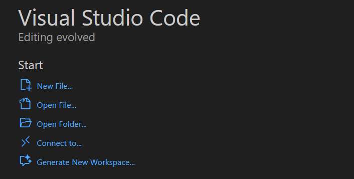
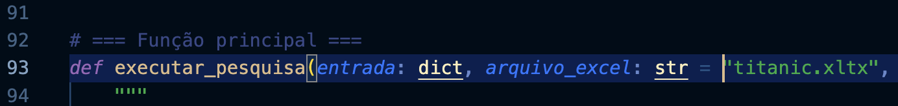
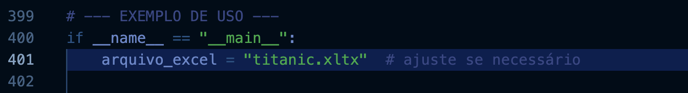
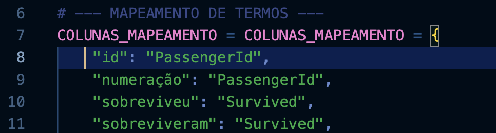

#  Tutorial: Como Rodar uma ferramente de pesquisa no VSCode

Este tutorial explica **passo a passo** como rodar um **ferramenta de pesquisa** dentro do **VSCode**, desde a instalação até a execução completa.  
O objetivo é ajudar usuários a entenderem como **abrir e testar fluxos** no ambiente Langflow de forma prática.

---

## 1. Baixando o VSCode

Antes de começar, é necessário ter o **VSCode** instalado no seu computador. É possível baixar por lojas de aplicativos, site do VSCode.

## 2. Baixando o Python
Depois de instalado é necessário baixar o Python. Ele pode ser baixado nas extensões dentro do VSCode, ou pelo terminal.

### 2.1 Pelas extensões do VSCode

- Abra a aba de extensões e procure "python" e clique instalar.

<p align="center">
  
</p>

> Agora o Python está instalado.

### 2.2 Pelo terminal

- No terminal rode

```bash
pip install python
```
> Agora o Python está instalado.

## 3. Abrindo uma pasta e arquivo
Para rodar a ferramenta é necessário que o arquivo esteja dentro de uma pasta local.
- Crie uma pasta com o nome desejado.
- No VSCode, clique em abrir pasta

<p align="center">
  
</p>

- Adicione um arquivo e de um nome que acabe com .py

> Por exemplo: pesquisa.py

- Copie o conteúdo do arquivo abaixo e cole dentro do arquivo.

👉🏼 [Clique aqui para visualizar e copiar o arquivo `pesquisa.py`](codigo/pesquisa.py)

## 4. Recursos necessários
Para o código funcionar é necessário instalar dois recursos, o pandas e o openpyxl

Para isso digite no terminal:

```bash
pip install pandas openpyxl
```

## 5. Modificações necessárias
Esse código está genérico no momento, então é necessário alterar algumas informações de acordo com a planilha desejada.

### 5.1 Caminho da Planilha
Para adicionar a planilha no código:
- Adicione a planilha dentro da pasta do projeto.
- Troque o nome da planilha dentro do código. É necessário trocar na linha 93 e na linha 401.

<p align="center">
  
</p>

<p align="center">
  
</p>

## 5.2 Adicionar termos substitutos 
Para facilitar na hora de realizar a pesquisa, é necessário definir termos que indiquem em qual coluna a ferramenta deve olhar de acordo com a pesquisa desejada.

- A partir da linha 8, você pode adicionar diversos termos para as colunas da sua planilha. Apenas siga o formato disponibilizado no código.

<p align="center">
  
</p>

## 5.2 Modificando a entrada
No final de código a o formato da entrada que vai rodar o código. É necessário alterar essa entrada de acordo com a pesquisa desejada.

Supondo que minha planilha tenha dados de passageiros do Titanic, e eu queira saber a média de idade dos passegeiros que sobreviveram, substituirei entrada por:

```bash
entrada = {
  "columns_to_show": [],
  "column_operation": ["idade"],
  "operation": ["media"],
  "comparisons": [], 
  "ranking": [],
  "group_by": [],
  "correlation": [],
  "special_conditions": [],
  "data": [
      {"column_name": "sobreviveram", "value": "1"}
      ]
}
```

## 6. Explicação de cada variável da entrada
- Columns_to_show : Aqui voce define quais colunas quer ver os valores.
- Column_operation : Aqui você define qual coluna será realizada a operação.
- Operation: Aqui você define qual operação será realizada. Há uma grande variedade de operações possíveis, como listar, média, diferença, soma, etc. Todas as operações podem ser encontradas no código a partir da linha 240.

<p align="center">
  
</p>

- Comparisons: usada para indicar um par de valores, categorias ou variáveis que você quer comparar entre si.. Exemplo caso eu quisesse ver se passageiros que pagaram mais caro tiveram maior chance de sobrevivência:

```bash
entrada = {
  "columns_to_show": ["tarifa", "sobrevivencia"],
  "column_operation": None,
  "operation": "compare_mean",
  "comparisons": ["tarifa", "sobrevivencia"],
  "ranking": [],
  "group_by": [],
  "correlation": [],
  "special_conditions": [],
  "data": [
    {"columns_name": "sobrevivencia", "value": "1"}
]
}
```
- Ranking: Aqui você define de qual coluna você quer um ranking, o número de posições e se será crescente ou decrescente. Exemplo caso eu queira ver top 5 passageiros que pagaram as tarifas mais altas:

```bash
entrada = {
  "columns_to_show": ["passageiros", "tarifas"],
  "column_operation": [],
  "operation": [],
  "comparisons": [],
  "ranking": [{{"column": "tarifas", "n": 5, "order": "desc"}}],
  "group_by": [],
  "correlation": [],
  "special_conditions": [],
  "data": []
}
```
- Group_by: Permite que você agrupe os dados por uma ou mais colunas antes de aplicar alguma operação. Exemplo caso eu quisesse ver a porcentagem de homens que sobreviveram:
```bash
entrada = {
  "columns_to_show": [],
  "column_operation": "sobreviveram",
  "operation": "porcentagem",
  "comparisons": [],
  "ranking": [],
  "group_by": ["homem"],
  "correlation": [],
  "special_conditions": ["homem == 'male'"],
  "data": [
      {"column_name": "sobreviveram", "value": "1"}
  ]
}
```
- Correlation: Calcula a correlação estatística entre duas colunas numéricas. Exemplo caso eu quisesse ver a correlação entre idade e sobrevivência:
```bash
entrada = {
  "columns_to_show": [],
  "column_operation": [],
  "operation": "correlacao",
  "comparisons": ["idade", "sobrevivencia"],
  "ranking": [],
  "group_by": [],
  "correlation": ["idade", "sobrevivencia"],
  "special_conditions": [],
  "data": []
}
```
- Special_conditions : serve como um campo para instruções extras, ou seja, condições especiais que não se encaixam nos filtros padrão. Exemplo caso eu quisesse ver quantos passageiros estavam com irmãos:
```bash
entrada = {
  "columns_to_show": [],
  "column_operation": "passageiros",
  "operation": "count",
  "comparisons": [],
  "ranking": [],
  "group_by": [],
  "correlation": [],
  "percentage": [],
  "special_conditions": ["irmaos > 0"],
  "data": []
}
```
- Data: Filtro de dados.
